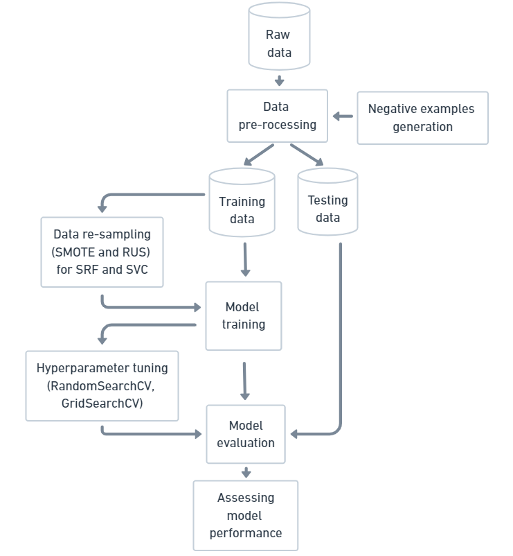
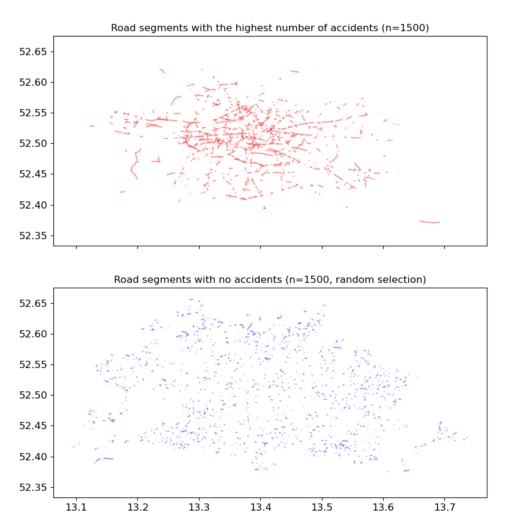
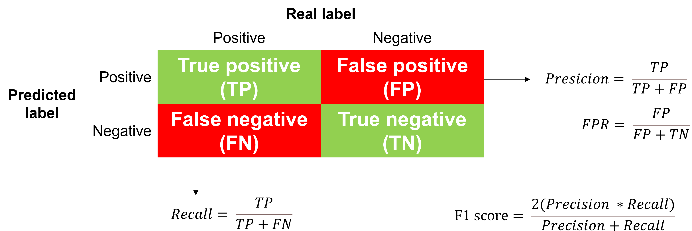
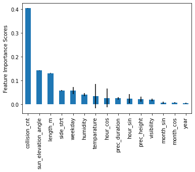

```{r setup, include=FALSE}
knitr::opts_chunk$set(echo = FALSE)

# Load dependencies 
library(reticulate) # For rendering Python code
library(kableExtra)
library(knitr)
```


## Problem

Traffic accidents are one of the leading causes of death and injuries globally, and in Germany they cause over 3,000 deaths and 300,000 injuries yearly. Studying traffic accidents and where and why they happen can help policy makers make our roads safer.

There are at least two key issues to tackle when predicting traffic accidents. First decision to make is on the granularity, or spatial precision, to which we predict accidents. One approach could be focusing only on a few select roads that are covered by sophisticated measurement instruments like loop detectors and cameras. This allows researchers to precisely measure important features such as traffic flow and lane occupancy. Another approach could be predicting accidents, or their severity, on datasets with millions of accidents aggregated at the level of the country. This approach helps uncover patterns that would be difficult to find on smaller datasets, but lacks precision that could help policy makers improve traffic safety at the level ofa  community or a city.

Second key issue with traffic accident prediction is a computational one. Although traffic accidents have serious consequences they remain, luckily, rare events. However, many machine learning models do not do well when predicting rare events -- in part due to the focus on minimisation of the overall error rather than the detection of the rare class. Fortunately, computational approaches and models that tackle imbalanced datasets do exist and seem to be successful in predicting rare events.

We wanted to build on previous work in two main ways. First, inspired by a recent paper [@hebert2019high] we applied a novel approach in traffic accident forecasting that aims to predicts the risk of an accident on a particular road segment withing a city road network at a particular day and hour. We believe that this approach is particularly useful for policy makers interested in road-safety improvement. Second, we explore and provide new evidence on the performance of different approaches for rare event prediction in the field of traffic accident forecasting.

## Data

We conducted this study using the example of accidents in Berlin using the following data sources:

* Records of traffic accidents in Berlin: [Open Data Berlin](https://daten.berlin.de/) shares records of all traffic accidents that happened between 2018 and 2020; a total of 38,851 occurrences. For this study we used data on GPS-coordinates, year, month, day of the week, and hour of the accident.

* Berlin road segment data: We used two datasets provided by the [Open Data Informationsstelle (Odis)](https://odis-berlin.de/ressourcen/): 
  + To match locations of traffic accidents (Figure 1a) to road segments in Berlin (Figure 1b) we used the existing [geometric information dataset]((https://daten.odis-berlin.de/de/dataset/detailnetz_strassenabschnitte/)) on road segments in Berlin. From here we also used data on the length of the road segment.
  + We used road segment surface [dataset](https://daten.odis-berlin.de/de/dataset/) to extract the information on whether a road segment is a main road or a side street.
  

```{r fig1, echo = FALSE, fig.show='hold', fig.align="center", fig.cap = "(a) Collision points (left), (b) Road Network (right)"}
knitr::include_graphics(c("figures/1a.png", "figures/1b.png"))
```


* Weather data: Using the [Wetterdienst API](https://wetterdienst.readthedocs.io/en/latest/
overview.html) we collected data on temperature, humidity, precipitation duration, precipitation height, and visibility for every accident location, day of the week, and hour of the day between 2018 and 2020 from 5 Berlin weather stations.

* Sun elevation: We used the Python API [PySolar](https://pysolar.readthedocs.io/en/latest/) to collect data on sun elevation angles per date and location in Berlin.


## Method 

The workflow of this study can be seen in Figure 2.

```{r fig2, eval = TRUE, echo = FALSE, fig.align='center',fig.cap = "Study workflow"}

```

### Generation of negative cases

After we collected raw data, we we first generated negative cases, that is, data points when accidents did not happen. In traffic accident forecasting only positive cases (that is, occurrence of the accidents) are recorded. This makes sense, particularly as most of such records come from a traffic authority responding to an accident. However, that also means that available datasets have no records of negative cases at all -- so they have to be generated. Luckily, having an accurate database of accidents (recorded by the Berlin police), means that we know when accidents did not happen -- and that is at all possible other locations and times that were not recorded as accidents! Of course, it is not feasible to analyse all cases where accidents did not happen, as that would be computationally difficult. What we did instead, following the usual approach, was to calculate all possible combinations of time and locations for negative events and then drew a sample from it. We tried different accident/non-accident rations, as we will describe later, but in the end the one we worked with was 5 non-accidents for every accident.

### Data pre-processing

The major part of data pre-processing included matching the accident GPS-locations to existing road segments in Berlin. This was done by creating a spatial join function and specifying a buffer. The matching function finds which road segments intersect the collision point's circle area and match these segments to the collision point. Increasing (decreasing) the buffer value makes the circle area larger (smaller), thereby  increasing (decreasing) the number of road segments matched to a collision point. For example, setting the buffer to 2m (Figure 3a) identifies fewer road segments than setting the buffer to 20m (Figure 3b). A bigger buffer was also more correct in detecting accidents that occurred on road intersections. Different buffer values were used to make sure that we match all accident and non-accident GPS-locations to corresponding segments.  

```{r fig3, echo = FALSE, fig.show='hold', fig.align="center", fig.cap = "(a) Matching 2m buffer (left), (b) Matching 20m buffer (right)"}
knitr::include_graphics(c("figures/2_2.png", "figures/2_20.png"))
```

We then matched all other data to road segments' midpoints. For weather features, we used the data for the closest weather station, and if that data was missing, second closest. Since Berlin accident dataset does not report the exact day of the month when the accident happened, we computed the monthly average per hour and used that information instead. Time features were recoded cyclicaly using sine and cosine functions to account for the dact that the extreme values (e.g. hour 1 and 23) have a similar meaning. The features we included in the model were:

1. month_cos and month_sin: cosine and sine of cyclical encoded month
2. hour_cos and hour_sin: cosine and sine of cyclical encoded hour
3. weekday: day of the week (Monday = 1, Sunday = 7)
4. collision_cnt: number of accidents at a road segment in the previous year/s
5. length_m: lenght of a road segment in meters
6. side_strt: road segment is a side street (1) or a main road (0)
7. temperature (°C)
8. humidity (%)
9. visibility (m)
10. prec_height: average mm per 10 minutes intervals in the hour before event
11. prec_duration: average minutes per 10 minutes intervals in the hour before the event
12. sun_elevation_angle: solar elevation angle in degrees
13. collision: the target we are predicting: accident occurred (1) vs. not (0)

We then split the dataset into training (years 2018 and 2019) and test (year 2020). The final training dataset had a total of 52,118 road segments where accidents occurred and 260,702 where they didn't. Here's a snippet of the final dataset we were working with:

```{r kable}
df <- read.csv("data/full_sample.csv")
#head <- head(df)

kable(head(df), "html") %>%
    kable_styling() %>%
    scroll_box(width = "100%", height = "200px")
```

<br>

And here's what the variables' distributions look like:

```{r fig4, eval = TRUE, echo = FALSE, out.width = '100%', fig.align='center', fig.cap = "Histograms of features for the training dataset"}
knitr::include_graphics("figures/histograms.png")
```

Finally, we can already get a glimpse of whether or not some road segments are more dangerous than others. As we can see from the Figure 5 below, it does seem that some main, long road segments -- that lead around the city centre or in it -- are more dangerous than small, side road segments. But, to see how correct we are when we make this prediction, we need to train classification models. 

```{r fig5, eval = TRUE, echo = FALSE, fig.align='center',fig.cap = "Road segments with the highest (above) and lowest (below) number of accidents"}

```


### Selected models

We implemented 7 machine learning models:

1. Logistic Regression (Logit)
2. Standard Random Forrest (SRF)
3. Balanced Random Forrest (BRF)
4. Standard Random Forrest with SMOTE and RUS (SRF_SMOTE_RUS)
5. Balanced Bagging (BB)
6. Support Vector Classifier with SMOTE and RUS (SCV_SMOTE_RUS)
7. Extreme Gradient Boosting (XGBoost)

The models we selected are widely used for various problems and also in prediction of rare events. However, a small note on SMOTE and RUS techniques will be made. SOMOTE and RUS are re-sampling techniques that have been found to work well for imbalanced datasets. A discussion of these techniques is beyond the scope of this article, but a detailed discussion can be found elsewhere [@chawla2002smote]. For this study, we applied SMOTE and RUS using 30% over-sampling and 50% under-sampling. In this case that means that on a training dataset containing 300,000 observations with imbalance factor of 5 (250,000 negative:50,000 positive), we first re-sample the minority class to have 30% the number of the majority class (75,000), then use random under-sampling to reduce the number of examples in the majority class to have 50% more than the minority class (150,000).

### Hyperparameter tuning strategy

We used random- and grid- search with 5-fold cross validation to tune our hyperparameters. As a scoring metric we chose the Area Under the ROC curve. We parametrized our search space by different hyperparameters unique to each model architecture; for instance, in Random Forest models, the number of trees, maximum depth, and minimum samples required to be at a terminal node, among others, were optimized. Moreover, we parametrized the sampling strategies - the intended class imbalance factor after re-sampling - that is applied to re-sample the dataset for our model implementations that use SMOTE and RUS.

### Evaluation approach

We evaluated our models by calculating the Area under the ROC curve (AUC-ROC) that is considered a good, general measure for classification problems. Additionally, we aimed for a model with a high Recall, which also implies a relatively higher false positive rate (FPR), and a lower prediction. As traffic accident prediction is a type of rare event prediction, our goal was to train a model with a high Recall since false positives can also correspond to high-risk circumstances which we also want to detect and, ultimately, avoid. An overview of these performance metrics and the corresponding confusion matrix can be seen in Figure 6.


```{r fig6, eval = TRUE, echo = FALSE, fig.align='center',fig.cap = "Calculation of Precision, Recall and F1-score in the Confusion Matrix"}

```

## Results

Before training the models on our dataset, we conducted an experiment to compare the performance of the baseline model with different ratios of positive and negative events (accidents vs. non-accidents). We compared results from a logistic regression model and a random forest model with two different imbalance ratios that were previously described in the literature: around around 2:1 [@santos2021machine] and 17:1 [@hebert2019high]. For this comparison we used only time features (year, month, weekday and hour) and the number of accidents per road segment. 

Our results indicated that the random forest model yielded the highest Recall for both imbalance ratios (70.4%), but that Precision was largely reduced by a high imbalance ratio. Similar trend of results, but with much worse evaluation metrics, was obtained by the logit model. AUC_ROC scores did not change much with the imbalance ratio. Therefore, we concluded that our models did not seem very sensitive to the imbalance factor of our data. This corroborated our approach of drawing a uniform random sample of non-accidents.

Finally, we trained our models on the training set and compared their performance on the test set. The results in Table 1 and the Figure 4 show the following:

* BRF distinguished between positive and negative classes the best, with an AUC_ROC of 88.7%. BRF also yielded the highest Recall (94.5%), which implies that it predicts most of the relevant results corresponding to high-risk situations, and still had an acceptable Precision (50.4%).
* Similar to BRF, applying over-sampling and under-sampling techniques to our imbalanced data combined with SRF resulted to a high AUC_ROC and Recall above 80% and a Precision of almost 70%.
* Without any balancing re-sampling techniques, the performance of SRF also has a high AUC_ROC of 84% with both Precision and Recall above 70%.
* With a high Recall, all models have similar performances except for BB which has a low Precision. The ROC curve also suggests that only BB has a lower performance among the models.
* Moreover, the Logit model actually performed quite well with 86.8% AUC_ROC, 80.6% Recall, and 67.6% Precision.
* SVC_SMOTE_RUS yielded the highest Precision of 89.3%, however, it had the lowest AUC_ROC (below 80%). Although BB had AUC_ROC and Recall above 80%, it resulted with a Precision of only 40%.

Therefore, we concluded that the best performing model was the Balanced Random Forest (BRF) that predicted 94.5% of traffic accidents in Berlin.

<br>
```{r, echo = FALSE}

results <- data.frame(model=c("Logit_baseline", "SFR_baseline", "Logit", "SRF", "BRF", "BB", "SRF_SMOTE_RUS", "SVC_SMOTE_RUS", "XGBoost"),
                    AUC_ROC=c("88.3%", "83.6%", "86.8%", "84.0%", "88.7%", "80.5%", "87.4%", "75.4%", "85.4%"),
                    Precision=c("58.1%", "73.3%", "67.6%", "77.5%", "50.4%", "40.4%", "68.1%", "89.3%", "75.4%"),
                    Recall=c("88.3%", "72.0%", "80.6%", "71.9%", "94.5%", "83.7%", "81.8%", "52.0%", "75.4%"),
                    F1_score = c("70.0%", "72.3%", "73.6%", "74.6%", "65.7%", "54.5%", "74.3%", "65.7%", "75.4%"))

kable(results, "html", caption="Comparison of Classification Models") %>%
    kable_styling() 

```

<br>

```{r fig7, fig.show='hold', fig.align="center",fig.cap = "Precision-Recall and ROC Curves of the 7 Classification Models"}
knitr::include_graphics(c("figures/prec_rec_curve.png", "figures/prec_rec_b_curve.png"))
```

## Analysis 

Figure 8 below shows the best features in our final model.


```{r fig8, eval = TRUE, echo = FALSE, fig.align='center',fig.cap = "Feature importance in the Balanced Random Forest model"}

```

Our results echo those of the previous studies: previous number of accidents at a road segment was by far the most predictive feature. Some other road infrastructure features closely related to the number of accidents, such as segment length and whether a road is a side street, were also important. From non-infrastructure related features, sun elevation angle was the most important one. Unlike in previous studies, weather features and time features were a bit less important here. One reason that might be is that Berlin dataset does not record an exact day of the year when the accident happened, only the day of the week. This also meant that the weather features had to be averaged, which of course reduced their precision.

With respect to our approach of applying combined re-sampling approaches - SMOTE and RUS - and a diverse set of models - linear, tree-based, SVC, XGBoost, Balanced Bagging - we achieved good performance with almost all models. However, we could not improve performance to established models such as Balanced Random Forest, which has been the overall best-performing model in terms of chosen evaluation metrics.

## Conclusion

Our study used several publicly available datasets to build a high-resolution traffic accident prediction models using 7 classification models. Our best-performing model, the Balanced Random Forest, yielded a 94.5% Recall at predicting road accidents in Berlin on a given road at a given date and hour with a 50% Precision. For future research, we suggest incorporating new features to describe the traffic flow and urban infrastructure (i.e., number of schools, proximity to central business districts, number of traffic lights, etc.) around the area where the accidents occurred, since these seem to be largely neglected in existing traffic prediction studies.

Ultimately, we hope that our project can be useful to policy makers for identifying the most dangerous road segments per hour of the day and, thus, be a basis for taking action on reducing risk of accidents. Our work also shows that providing administrative data - through initiatives such as Open Data Berlin - can create value to the general public.
